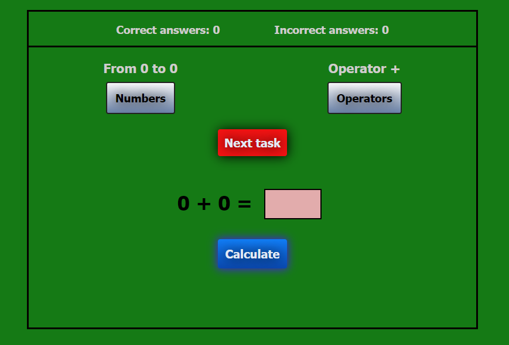

## Your math App for your every day practice.



To get a local copy of the code, clone it using git:

```
git clone https://github.com/92gahov/Maths-exercises
cd Maths-exercises
```

Open index.html

### `Final result` <a href="https://maths-exercises.surge.sh/" target="_blank">here</a>
